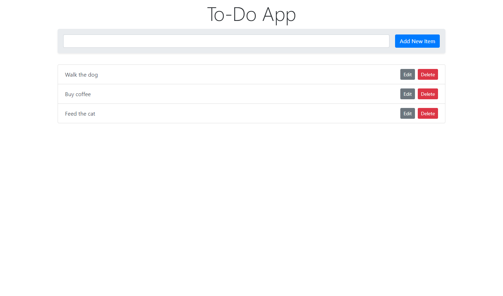

# Simple Todo App

A todo list to keep track everything in one place. Just list all the tasks, so you get it out of your head and enjoy your peace of mind along the way.


## Built With

- HTML
- Bootstrap 4
- JavaScript
- Node
- Express
- MongoDB
- Authentication & Security
- Heroku



Visit the [live preview](https://fullstack-todo-application.herokuapp.com/).


## Installation

Clone the repository, change to the directory, and use npm to install dependencies.

```sh
$ git clone hhttps://github.com/genesisgabiola/todo-app.git
$ cd todo-app
$ npm install
```


## Usage

1. Add `.env` file to your main folder, then add these with your own values (exept for the `SECURITY_PASSWORD` value);

```
CONNECTION_STRING=
SECURITY_PASSWORD=Basic dXNlcjpwYXNzd29yZA==
```

2. Run node server and watch for any changes.

```sh
$ npm run watch
```

3. Open your browser and launch the website at [localhost:3000](https://localhost:3000).

4. Enter the Username and Password

```
Username: user
Password: password
```


## How to Contribute?

- Open an [issue](https://github.com/genesisgabiola/todo-app/issues).
- Contact me on [twitter](http://twitter.com/genesisgabiola).

Any queries, suggestions, issues to report or critics are welcome :) You can freely connect to me.
